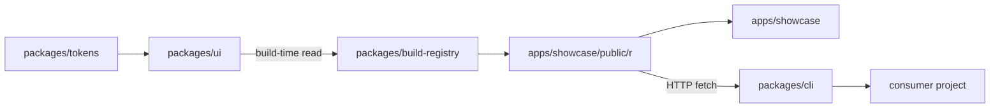
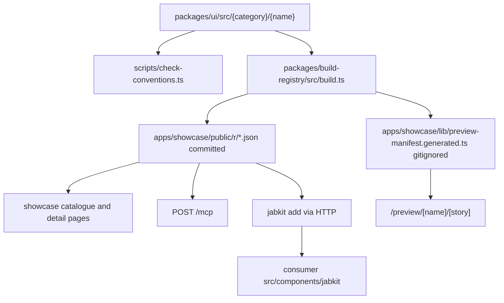

# Architecture

JabKit is a pnpm + Turborepo monorepo. The product is source: components live in this repository, are published as registry JSON, and are copied into consumer projects. No workspace package is published to npm today (`private: true` on every `package.json`).

Repository code is authoritative when this document disagrees with an assumption.

## Workspaces

`pnpm-workspace.yaml` includes `apps/*` and `packages/*`. Node is `>=24` (`.nvmrc` is `24`); the package manager is `pnpm@11.24.0`.

| Path | Package | Responsibility |
| --- | --- | --- |
| `packages/ui` | `@jabkit/ui` | Component source. 49 components under `src/atoms` (13), `src/marketing` (29), `src/dashboard` (7). Owns `src/lib/cn.ts`, `src/lib/theme.ts`, and Storybook in `.storybook/`. No root barrel. |
| `packages/tokens` | `@jabkit/tokens` | `--jk-*` design tokens. Exports `./tokens.css` and `./tokens`. See [theming.md](theming.md). |
| `packages/build-registry` | `@jabkit/build-registry` | Registry generator (`src/build.ts`) and type contract (`src/index.ts`). See [registry.md](registry.md). |
| `packages/cli` | `@jabkit/cli` | Consumer installer: `jabkit init \| add \| upgrade`. See [cli.md](cli.md). |
| `packages/mcp` | `@jabkit/mcp` | Tool-name tuple only. The HTTP endpoint lives in the showcase. See [mcp.md](mcp.md). |
| `apps/showcase` | `@jabkit/showcase` | Next.js 16 catalogue, previews, samples, and `/mcp`. Hosts generated JSON at `public/r/`. See [showcase.md](showcase.md). |
| `apps/verify` | `@jabkit/verify` | External-consumer harness. `pnpm --filter @jabkit/verify sync` runs the CLI `add --all --force` against a local registry. Installed files under `src/components/jabkit` are gitignored. |

Root scripts that matter (`package.json`): `dev` (showcase), `storybook`, `lint`, `typecheck`, `check:conventions`, `registry:build`, `registry:verify`, and the composite gate `check`.

## Dependency direction

Rules, including the ones that are *not* edges:

- `packages/ui` never imports from `apps/*`.
- Atoms may depend on other atoms through `registryDependencies`. Atoms never depend on marketing or dashboard.
- Marketing and dashboard never depend on each other. Either may list atoms in `registryDependencies`.
- The CLI never reads the registry from disk. It always fetches `{registry}/r/{name}.json` over HTTP.

## Source to consumer

1. **Source.** A component lives in `packages/ui/src/{category}/{kebab-name}/` with six required files (`{Name}.tsx`, `{Name}.stories.tsx`, `{Name}.preview.tsx`, `{Name}.types.ts`, `{Name}.meta.ts`, `index.ts`) and an optional `{Name}.mocks.ts`. Full checklist: [adding-a-component.md](adding-a-component.md).
2. **Convention gate.** `scripts/check-conventions.ts` walks the three category directories. It resolves paths from `process.cwd()`, so it only works when run from the repo root.
3. **Registry build.** `packages/build-registry/src/build.ts` deletes and regenerates `apps/showcase/public/r/`, then writes the preview manifest. Details: [registry.md](registry.md).
4. **Showcase.** `apps/showcase/lib/registry.ts` reads `public/r/*.json` from disk at request time. `next.config.ts` includes `./public/r/**` in `outputFileTracingIncludes` so the JSON ships with the build.
5. **Preview.** `apps/showcase/app/preview/[name]/[story]/page.tsx` looks the name up in the generated `previewManifest`, dynamically imports `{Name}.preview.tsx`, and renders the requested story key.
6. **Consumer.** The CLI fetches registry JSON, walks `registryDependencies`, rewrites imports, and writes files. Details: [cli.md](cli.md).

## Generated vs source-controlled

| Artifact | Generated? | Git | Rule |
| --- | --- | --- | --- |
| `packages/ui/src/**` | No | Source | Hand-authored. Never invent a second copy in the showcase. |
| `apps/showcase/public/r/*.json` | Yes, by `pnpm registry:build` | **Committed** | Never edit by hand. `pnpm registry:verify` fails if this tree is dirty after a rebuild. |
| `apps/showcase/public/previews/*` | Yes, by `pnpm previews:build` | **Committed** | Never edit by hand. `pnpm previews:verify` fails if hashes or files are stale. |
| `apps/showcase/public/assets/*` | Yes, by `pnpm assets:vendor` | **Committed** | Never edit by hand. Rewrite source URLs through the vendor script. |
| `apps/showcase/lib/preview-manifest.generated.ts` | Yes, same build | **Gitignored** | Regenerated by `pnpm registry:build`. Showcase `dev` / `build` / `typecheck` run `pnpm -w registry:build` first. |
| `apps/verify/src/components/jabkit/**` | Yes, by the CLI | Gitignored | Output of `pnpm --filter @jabkit/verify sync`. |
| `.jabkit/` | Yes, by the CLI | Gitignored | Consumer install manifest. |
| `apps/showcase/tsconfig.tsbuildinfo` | Yes, TypeScript incremental | Currently committed | Mutated by `pnpm typecheck` / `pnpm check`. Expect a dirty working tree after those commands. Gitignoring it is a follow-up, not part of this documentation work. |

## Path aliases

| Workspace | `@/*` maps to |
| --- | --- |
| `packages/ui` (`tsconfig.json` and Storybook Vite) | `packages/ui/src/*` |
| `apps/showcase` | `../../packages/ui/src/*` |
| `apps/verify` | `./src/*` |

The showcase alias is the one that surprises people. Inside `apps/showcase`, `@/atoms/button` and `@/marketing/about8` resolve into the library, not into the app. Samples compose library blocks through that alias. Showcase chrome lives under relative imports (`../components/...`, `../lib/...`) on purpose.

## Tooling

- **Turbo** (`turbo.json`): `build` depends on `^build` with outputs `.next/**` and `dist/**`; `typecheck` depends on `^typecheck`; `dev` is persistent and uncached.
- **Biome** is the only lint and format tool. `biome.json` excludes `.next`, `.turbo`, `node_modules`, `storybook-static`, `apps/showcase/public/r`, and `.shadcn-src`.
- **Husky:** `pre-commit` runs `pnpm biome check --staged`; `commit-msg` runs commitlint with `@commitlint/config-conventional`.
- **There is no `.github/` directory.** No CI workflows, no PR template, no issue templates. `pnpm check` at the repo root is the whole quality gate.

`pnpm check` is `pnpm lint && pnpm typecheck && pnpm check:conventions && pnpm registry:verify && pnpm previews:verify`.

## `.shadcn-src/`

A vendored upstream snapshot of a shadcn/ui Next app. `scripts/convert-shadcn.ts` reads `.shadcn-src/src/components/ui` and writes a subset of atoms into `packages/ui/src/atoms`. It is excluded from biome. It is not part of the build, the registry, or the showcase. Do not treat its internals as JabKit architecture.

## Boundaries not to casually violate

- Do not add a `packages/ui/src/index.ts` barrel. Discovery is folder-driven.
- Do not hand-edit `apps/showcase/public/r/*.json` or `preview-manifest.generated.ts`.
- Do not introduce a fourth category without changing `packages/build-registry/src/build.ts`, `scripts/check-conventions.ts`, and `apps/showcase/app/[category]/page.tsx` (`validCategories`) together.
- Do not import marketing from dashboard or the reverse. Do not import either from an atom.
- Do not put distributable component source under `apps/showcase`. Showcase files never ship to consumers.
- Do not run `scripts/check-conventions.ts` from a nested package directory; it uses `process.cwd()`.
